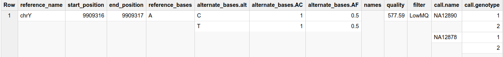
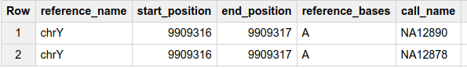
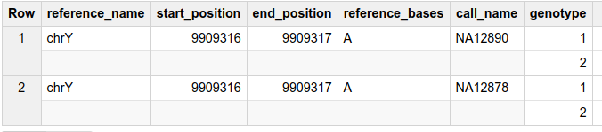
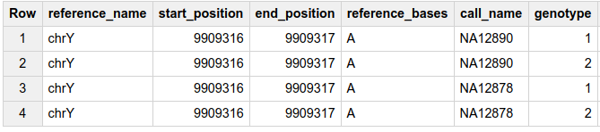
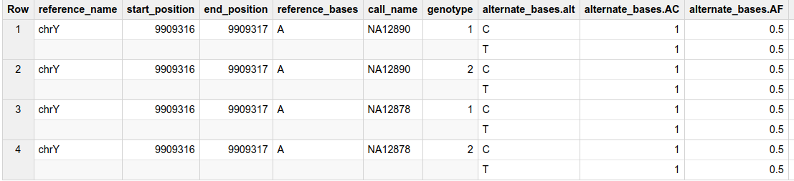
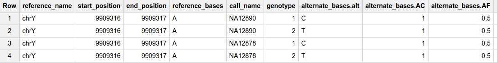
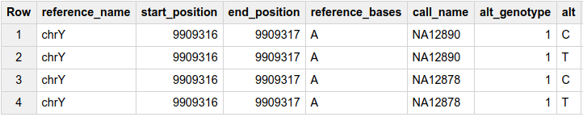
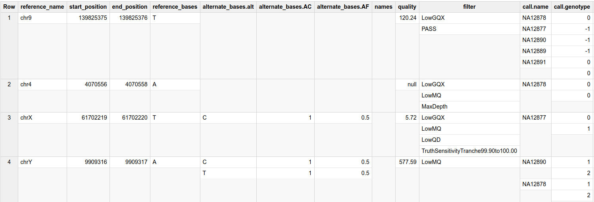
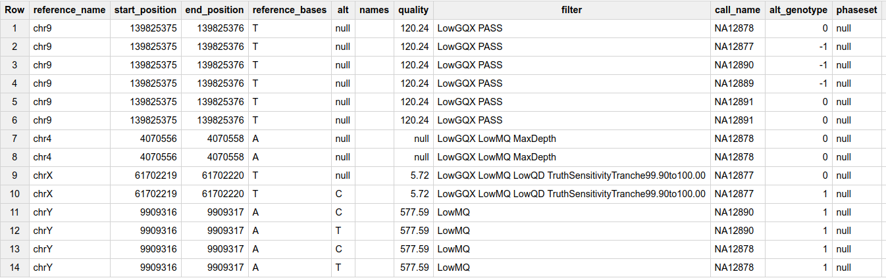

# Flattening the BigQuery table

Querying multiple independently repeated fields or calculating the cross product
of such fields requires "flattening" the BigQuery records. You may have seen
error messages like `"Cannot query the cross product of repeated fields ..."`
from BigQuery in such scenarios. This page describes the workarounds for
enabling such queries and exporting a flattened BigQuery table that can be
directly used in tools that required a flattened table structure (e.g. for
easier data visualization).

Please note that the instructions in this page are for
[Standard SQL](https://cloud.google.com/bigquery/docs/reference/standard-sql/)
and not
[Legacy SQL](https://cloud.google.com/bigquery/docs/reference/legacy-sql).


## Flattening basics

Consider the following BigQuery row:



It contains two alternate bases (`C` and `T`) and two calls (`NA12890`
and `NA12878`).

To get a table that contains one call per row, you need to explicitly flatten
the table on the repeated call record as follows:

```
#standardSQL
SELECT
  reference_name, start_position, end_position, reference_bases,
  call.name AS call_name
FROM
  `project.dataset.table` AS t,
  t.call AS call
```




Note that BigQuery throws the error
`"Cannot access field name on a value with type ARRAY<STRUCT<name ..."` if you
do not include the additional `t.call AS call` statement in the `FROM` clause.
Please see
[this page](https://cloud.google.com/bigquery/docs/reference/standard-sql/migrating-from-legacy-sql#removing_repetition_with_flatten)
for more details. Also, note that explicitly using `UNNEST` is not necessary as
a fully-qualified path is used, but you may also use `UNNEST(call) AS call`
instead of `t.call AS call`. Please see
[here](https://cloud.google.com/bigquery/docs/reference/standard-sql/query-syntax#field_path)
for more details.

You can include additional information for each call by adding them to the
`SELECT` clause. For instance, the following query adds the call genotypes (as
an array of integers) to the result.

```
#standardSQL
SELECT
  reference_name, start_position, end_position, reference_bases,
  call.name AS call_name, call.genotype
FROM
  `project.dataset.table` AS t,
  t.call AS call
```



To further flatten the BigQuery table on the genotype array (i.e. have one
genotype per row), you can add another explicit join with `call.genotype` as
follows:

```
#standardSQL
SELECT
  reference_name, start_position, end_position, reference_bases,
  call.name AS call_name, genotype
FROM
  `project.dataset.table` AS t,
  t.call AS call,
  call.genotype AS genotype
```



Note that in this case, the call names are duplicated as each call contains
two genotype values.

Let's add `alternate_bases` to the `SELECT` clause, which is an independently
repeated record:

```
#standardSQL
SELECT
  reference_name, start_position, end_position, reference_bases,
  call.name AS call_name, genotype, alternate_bases
FROM
  `project.dataset.table` AS t,
  t.call AS call,
  call.genotype AS genotype
```



This result looks odd as it contains both `alternate_bases` even though
we have flattened the `genotype` column. We really only want to return the
particular alternate base that matches the index of the `genotype` column. This
can be done using `ORDINAL` as follows:

```
#standardSQL
SELECT
  reference_name, start_position, end_position, reference_bases,
  call.name AS call_name, genotype,
  IF(genotype > 0, alternate_bases[ORDINAL(genotype)], NULL) AS alternate_bases
FROM
  `project.dataset.table` AS t,
  t.call AS call,
  call.genotype AS genotype
```



Note that the semantics of the value of the `genotype` column has changed
as each row only contains a single alternate allele. As a result, you may
decide to reformat that column using
`IF(genotype > 0, 1, genotype) AS alt_genotype`, which results to:
  * `0` implying reference match.
  * `1` implying match to the particular alternate specified in the row.
  * `-1` implying not called. Note that Variant Transforms uses `-1` to denote
    genotypes that are not called (i.e. `.` in the VCF file).

Finally, to only include the `alternate_bases.alt` column, you need to
explicitly flatten on the `alternate_bases` record as well and use the index as
a filtering criteria as follows:

```
#standardSQL
SELECT
  reference_name, start_position, end_position, reference_bases,
  call.name AS call_name,
  IF(genotype > 0, 1, genotype) AS alt_genotype,
  IF(genotype > 0, alts.alt, NULL) AS alt
FROM
  `project.dataset.table` AS t,
  t.call AS call,
  call.genotype AS genotype
LEFT JOIN
  t.alternate_bases AS alts WITH OFFSET AS a_index
WHERE
  genotype IN (a_index + 1, 0, -1)
```



Please note the explicit `LEFT JOIN` clause in this case as we also want to
include any record that does not have an alternate base. You may choose to use
`INNER JOIN` (or simply include
`t.alternate_bases AS alts WITH OFFSET AS a_index` in the `FROM` clause) to
only include records that have at least one alternate base.


## Example query for flattening BigQuery table

With the background above, you can flatten the BigQuery table to not contain
any repeated records using the query template shown below. Note that there are
some semantic changes as the actual genotype value no longer corresponds to the
index in the alternate base, so it's set to `1`, `0` or `-1` if it matches
the alternate base, reference, or is not set, respectively.

```
#standardSQL
SELECT
  reference_name, start_position, end_position, reference_bases,
  IF(genotype > 0, alts.alt, NULL) AS alt,
  ARRAY_TO_STRING(t.names, ' ') AS names,
  t.quality,
  ARRAY_TO_STRING(t.filter, ' ') AS filter,
  call.name AS call_name,
  IF(genotype > 0, 1, genotype) AS alt_genotype,
  call.phaseset
FROM
  `project.dataset.table` AS t,
  t.call AS call,
  call.genotype AS genotype
LEFT JOIN
  t.alternate_bases AS alts WITH OFFSET AS a_index
WHERE
  genotype IN (a_index + 1, 0, -1)
```

For other repeated fields, you may choose to either concatenate them as a single
field (i.e. use `ARRAY_TO_STRING`) or add them to the `FROM` or `LEFT JOIN`
clause to explicitly flatten on those fields as well.

You may  materialize the result of this query into a new table following the
instructions
[here](https://cloud.google.com/bigquery/docs/tables#creating_a_table_from_a_query_result).

### Example result

Running the above query on the following table:



Produces the following output:



