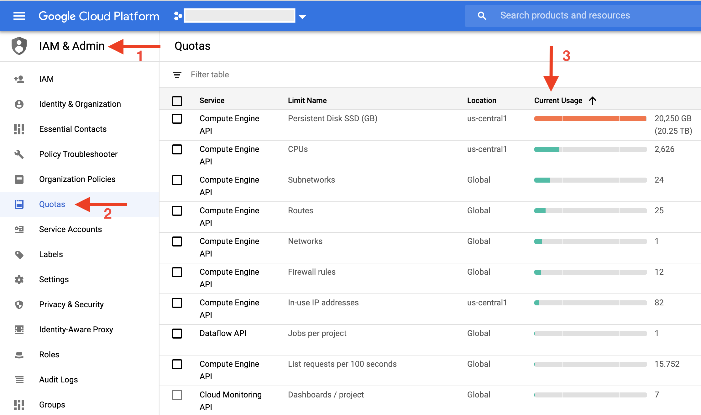

# Handling large inputs

The Variant Transforms pipeline can process hunderds of thousands of files,
millions of samples, and billions of records. There are a few settings that
may need to be adjusted depending on the size of the input files. Each of these
settings are explained in the sections below.

Default settings:

```
/opt/gcp_variant_transforms/bin/vcf_to_bq ... \
  --max_num_workers <default is automatically determined> \
  --worker_machine_type <default n1-standard-1> \
  --disk_size_gb <default 250> \
  --worker_disk_type <default PD> \
  --keep_intermediate_avro_files \
  --sharding_config_path <default gcp_variant_transforms/data/
      sharding_configs/homo_sapiens_default.yaml> \
```

#### `--max_num_workers`

By default, Dataflow uses its autoscaling algorithm to adjust the number of
workers assigned to each job (limited by the Compute Engine quota). You may
adjust the maximum number of workers using `--max_num_workers`. You may also use
`--num_workers` to specify the initial number of workers to assign to the job.

#### `--worker_machine_type`

By default, Dataflow uses the `n1-standard-1` machine, which has 1 vCPU and
3.75GB of RAM. You may need to request a larger machine for large datasets.
Please see https://cloud.google.com/compute/pricing#predefined_machine_types
for a list of available machine types.

We have observed that Dataflow performs more efficiently when running
with a large number of small machines rather than a small number of large
machines (e.g. 200 `n1-standard-4` workers instead of 25 `n1-standard-32`
workers). This is due to disk/network IOPS (input/output operations per second)
being limited for each machine especially if [merging](variant_merging.md) is
enabled.

Using a large number of workers may not always be possible due to disk and
IP quotas. As a result, we recommend using SSDs (see
[`--worker_disk_type`](#--worker_disk_type)) when choosing a large (
`n1-standard-16` or larger) machine, which yields higher disk IOPS and can avoid
idle CPU cycles. Note that disk is significantly cheaper than CPU, so always try
to optimize for high CPU utilization rather than disk usage.

#### `--disk_size_gb`

By default, each worker has 250GB of disk. The aggregate amount of disk space
from all workers must be at least as large as the uncompressed size of all VCF
files being processed. However, to accomoddate for intermediate stages of the
pipeline and also to account for the additional overhead introduced by the
transforms (e.g. the sample name is repeated in every record in the BigQuery
output rather than just being specified once as in the VCF header), you
typically need 3 to 4 times the total size of the raw VCF files.

In addition, if [merging](variant_merging.md) is enabled, you may
need more disk per worker (e.g. 500GB) as the same variants need to be
aggregated together on one machine.

#### `--worker_disk_type`

SSDs provide significantly more IOPS than standard persistent disks, but are
more expensive. However, when choosing a large machine (e.g. `n1-standard-16`),
they can reduce cost as they can avoid idle CPU cycles due to disk IOPS
limitations.

As a result, we recommend using SSDs if [merging](variant_merge.md) is enabled: these
operations require "shuffling" the data (i.e. redistributing the data among
workers), which require significant disk I/O.

Set
`--worker_disk_type compute.googleapis.com/projects//zones//diskTypes/pd-ssd`
to use SSDs.

### Adjusting Quotas

Compute Engine enforces quota on maximum amount of resources that can be used
at any time for variety of reasons. Please see
https://cloud.google.com/compute/quotas for more details. As a result, you may
need to adjust the quota to satisfy the job requirements. All flags mentioned
above would be ineffective if you do not have enough quota. In other words, Dataflow
autoscaling would not be able to raised the number of workers to reach target workers number.
One way to confirm this is to check the *current usage* of your quotas.
Following image shows a situation where `Persistent Disk SSD` in `us-central1` region has
reached its maximum value: 



To resolve situations like this, you need to increase the following
Compute Engine quotas accordingly:
* `In-use IP addresses`: One per worker.
* `CPUs`: At least one per worker. More if larger machine type is used.
* `Persistent Disk Standard (GB)`: At least 250GB per worker. More if larger
  disk is used.
* `Persistent Disk SSD (GB)`: Only needed if `--worker_disk_type` is set to SSD.
  Required quota size is the same as `Persistent Disk Standard`.

Value assigned to these quotas will be the upper limit of
available resources for your job. For example, if the quota for
`In-use IP addresses` is 10, but you try to run with `--max_num_workers 20`,
your job will be running with at most 10 workers because that's all your GCP
project is allowed to use.

Please note you need to set quotas for the region that your Dataflow pipeline is running.
For more information related to regions please refer to our
[region documentation](setting_region.md).   

## Other options to consider 

### Running preprocessor/validator tool

Since processing large inputs can take a long time and can be costly, we highly
recommend running the [preprocessor/validator tool](vcf_files_preprocessor.md)
prior to loading the full VCF to BigQuery pipeline to find out about any
invalid/inconsistent records. This can avoid failures due to invalid records
and can save time/cost. Depending on the quality of the input files, you may
consider running with `--report_all_conflicts` to get the full report (it takes
longer, but is more accurate and is highly recommended when you're not sure
about the quality of the input files).

### Sharding

Sharding the output significantly reduces the query costs once the data is queries in
BigQuery. It also optimizes the cost and time of the pipeline. As a result, we 
enforce sharding for all runs of variant Transforms, please see the 
[documentation](sharding.md) for more details.

For very large inputs, you could use `--sharding_config_path` to only process
and import a small region of genomes into BigQuery. For example, if your sharding
config file is the following then your output table will only contain variants of
chromosome 1 in the range of `[1000000, 2000000]`.
```
-  output_table:
     table_name_suffix: "chr1_1M_2M"
     regions:
       - "chr1:1,000,000-2,000,000"
       - "1"
     partition_range_end: 2,000,000
```

### Saving AVRO files
If you are processing large inputs, you could set the `--keep_intermediate_avro_files`
as a safety measure to ensure the result of your Dataflow pipeline is stored in case
something goes wrong while we copy AVRO files into BigQuery. Note that the main cost of
running Variant Transforms is due to resources used in Dataflow pipeline; loading
AVRO files to BigQuery is free. So it makes perfect sense to store the intermediate AVRO 
files to avoid wasting the output of Dataflow. For more information about this flag please
refer [importing VCF files](vcf_to_bigquery.md) docs.

The only caveat here is the extra cost of storing AVRO files in Google Cloud Storage bucket.
To avoid this extra cost we recommend loading AVRO files into BigQuery and delete them. In
case your import job failed and you need help with loading AVRO files into BigQuery please
let us know by submitting an issue.  
