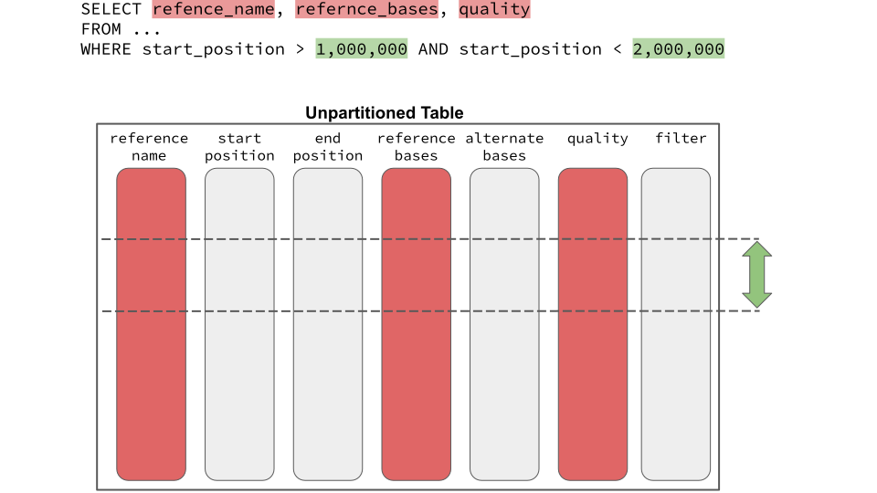
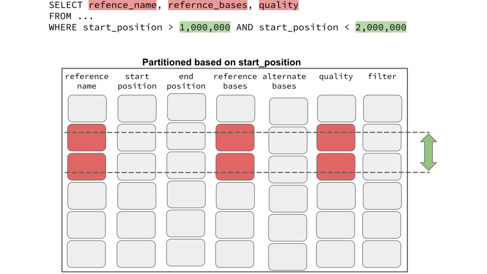

# Reducing cost of queries on BigQuery

The [pricing model of BigQuery](https://cloud.google.com/bigquery/pricing#queries)
is based on the total data processed in the columns selected by each query
regardless of filtering criteria specified by `WHERE` or `LIMIT` conditions.
For example, if you want to analyze variants of a small genomic region
by querying a table that contains an entire genome, you would write a query similar to the following:

In this example BigQuery processes all variants even though the query is
limited to the variants in `[1000000, 2000000]` region. This query will cost the entire size
of the columns being accessed in the SELECT clause, regardless of the `WHERE`
clause. 

This extra cost can add up to a significant amount, specially if a few
*hot spots* in the genome are being queried frequently. We are offering 
three techniques to significantly reduce the cost of queries like this. In the 
following sections we briefly explain each technique:

## (I) Sharding per chromosome

The first technique for reducing the cost of queries is to split single output 
table containing all variants into multiple smaller tables, we call this technique *sharding*.
Variant transforms shards its output into multiple tables, each containing
variants of a specific region of a genome, according to a 
[sharding config file](sharding.md). Our default 
[config file](gcp-variant-transforms/gcp_variant_transforms/data/sharding_configs/homo_sapiens_default.yaml)
results in one output table per chromosome. 

By splitting output tables based on the `reference_name` you are
guaranteed that per-chromosome queries will only process variants of the
chromosome under study. 

As a concrete example, during the process of publishing
[gnomAD on GCP marketplace](https://console.cloud.google.com/marketplace/details/broad-institute/gnomad)
we imported [gnomAD v3](https://gnomad.broadinstitute.org/) VCF files into 
a single BigQuery table with 707,950,943 rows which occupied 1.1 TB storage. 
After splitting by chromosome, we ended up with smaller tables for each chromosome,
here are some of their sizes:

| Chromosome | Number of Rows  |  Size (GB) |
|------------|-----------------|------------|
| Chr1       | 55,215,812      | 88.31      |
| Chr2       | 58,605,556      | 94.01      |
| Chr3       | 47,688,920      | 77.78      |
| Chr21      | 10,248,793      | 15.62      |
| Chr22      | 10,882,958      | 17.78      |
| ChrY       | 1,344,278       | 1.64       |
| ChrX       | 28,156,663      | 40.51      |

Other than making each table smaller and more manageable, sharding per chromosome
is a prerequisite for the next cost reduction technique.

## (II) BigQuery Partitioning
 
BigQuery [partitioning](https://cloud.google.com/bigquery/docs/partitioned-tables#integer_range)
is a technique that divides a large table into segments, called partitions,
this makes it easier to manage and query your data. By dividing a large table into
smaller partitions, you can improve query performance, and you can control costs by
reducing the number of bytes read by a query.

As we mentioned earlier, since BigQuery uses a columnar data structure, price of a
query is set according to the total data processed in the columns you select.
For large tables, such as gnomAD, this cost will be very significant, especially
if we are querying a small region of genome. 

Partitioning is the perfect solution here: BigQuery considers the `WHERE` clause
and based on that it only processes the set of partitioning that contain rows that
are relevant to the query. Following figure schematically shows the cost of previous
query on a table which is partitioned based on of `start_position` column :

Partitioning is a very effective technique to reduce the cost of queries, specially
for the genomics data where majority of the queries are analyzing a small genomic region.
Table partitioning comes at no cost, and allows to divide a table up to 4000
segments. Appending to a paritioned table will not degrade the performance and all newly
added rows will be stored in the right partition. Also you can know query cost before
running your query. Because partition pruning is done before the query runs, 
you can get the query cost through a [dry run](https://cloud.google.com/bigquery/docs/dry-run-queries). 

## (III) BigQuery Clustering

[BigQuery clustering](https://cloud.google.com/bigquery/docs/clustered-tables)
is a technique for automatically organizing a table  based on the
contents of one or more columns. Clustered columns
are used to colocate related data. More specifically, BigQuery sorts the data
based on the values of the clustered columns and organizes the data into
multiple blocks in BigQuery storage. You can use up to 4 columns to cluster your
BigQuery tables. 

Clustering can improve the performance of certain types of queries such as
queries that use filter clauses and queries that aggregate data of clustered
columns. When you submit such a query, BigQuery uses the sorted blocks to
eliminate scans of unnecessary data. Similarly, performance of aggregation
queries is improved because the sorted blocks colocate rows with similar values.
For more information about clustering please refer to this
[blog post](https://medium.com/@hoffa/bigquery-optimized-cluster-your-tables-65e2f684594b).

Note that you apply partitioning and clustering to the same integer column, to get the
benefits of both. In this case, your data will first partition according to the 
specified integer ranges. Within each range, if the volume of data is large enough,
the data will also be clustered. When the table is queried, partitioning sets an
upper bound of the query cost based on partition pruning. There might be other
query cost savings when the query actually runs.

Our analyses show that using clustering in addition to partitioning was very effective
for large tables. For example, sample lookup optimized table of chromosome1 of
1000Genome dataset has 16,196,107,376 rows (2.51 TB table size). Applying clustering
in addition to partitioning to this table reduces the query costs by a factor of `4x`.

Unlike partitioning, If you append data to an existing clustered table it will become
partially sorted and thus its performance improvement and cost reductions will degrade.
To learn more about clustering vs partitioning please refer to
[BigQuery's documentation](https://cloud.google.com/bigquery/docs/partitioned-tables#ir_partition_cluster).  

