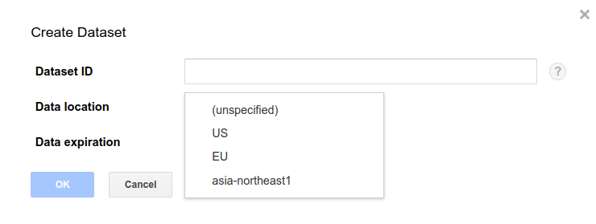

# Setting GCP region

## What to consider

Google Cloud Platform services are available in [many
locations](https://cloud.google.com/about/locations/) across the globe.
You can minimize network latency and network transport costs by running your
Dataflow job in the same region as its input bucket, output dataset, and
temporary directory are located. More specifically, in order to run Variant
Transforms most efficiently you should make sure all the following resources
are located in the same region:
* Your source bucket set by  `--input_pattern` flag.
* Your pipeline's temporary location set by `--temp_location` flag.
* Your output BigQuery dataset set by `--output_table` flag.
* Your Dataflow pipeline set by `--region` flag.
* Your Life Sciences API location set by `--location` flag.

## Running jobs in a particular region
The Dataflow API [requires](https://cloud.google.com/dataflow/docs/guides/specifying-exec-params#configuring-pipelineoptions-for-execution-on-the-cloud-dataflow-service)
setting a [GCP
region](https://cloud.google.com/compute/docs/regions-zones/#available) via
`--region` flag to run.

When running from Docker, the Cloud Life Sciences API is used to spin up a
worker that launches and monitors the Dataflow job. Cloud Life Sciences API
is a [regionalized service](https://cloud.google.com/life-sciences/docs/concepts/locations)
that runs in multiple regions. This is set with the `--location` flag. The
Life Sciences API location is where metadata about the pipeline's progress
will be stored, and can be different from the region where the data is
processed. Note that Cloud Life Sciences API is not available in all regions,
and if this flag is left out, the metadata will be stored in us-central1. See
the list of [Currently Available Locations](https://cloud.google.com/life-sciences/docs/concepts/locations).

In addition to this requirment you might also
choose to run Variant Transforms in a specific region following your project’s
security and compliance requirements. For example, in order
to restrict your processing job to europe-west4 (Netherlands), set the region
and location as follows:

```bash
COMMAND="/opt/gcp_variant_transforms/bin/vcf_to_bq ...

docker run gcr.io/cloud-lifesciences/gcp-variant-transforms \
  --project "${GOOGLE_CLOUD_PROJECT}" \
  --region europe-west4 \
  --location europe-west4 \
  --temp_location "${TEMP_LOCATION}" \
  "${COMMAND}"
```

Note that values of `--project`, `--region`, and `--temp_location` flags will be automatically
passed as `COMMAND` inputs in [`piplines_runner.sh`](docker/pipelines_runner.sh).

Instead of setting `--region` flag for each run, you can set your default region
using the following command. In that case, you will not need to set the `--region`
flag any more. For more information, please refer to
[cloud SDK page](https://cloud.google.com/sdk/gcloud/reference/config/set).

```bash
gcloud config set compute/region "europe-west1"
```

Similarly, you can set the default project using the following commands:
```bash
gcloud config set project GOOGLE_CLOUD_PROJECT
```
If you are running Variant Transforms from GitHub, you need to specify all three
[required Dataflow inputs](https://cloud.google.com/dataflow/docs/guides/specifying-exec-params#configuring-pipelineoptions-for-execution-on-the-cloud-dataflow-service)
as below.

```bash
python3 -m gcp_variant_transforms.vcf_to_bq \
  ... \
  --project "${GOOGLE_CLOUD_PROJECT}" \
  --region europe-west1 \
  --temp_location "${TEMP_LOCATION}"
```

## Setting Google Cloud Storage bucket region

You can choose your [GCS bucket's region](https://cloud.google.com/storage/docs/locations)
when you are [creating it](https://cloud.google.com/storage/docs/creating-buckets#storage-create-bucket-console).
When you create a bucket, you [permanently
define](https://cloud.google.com/storage/docs/moving-buckets#storage-create-bucket-console)
its name, its geographic location, and the project it is part of. For an existing bucket, you can check
[its information](https://cloud.google.com/storage/docs/getting-bucket-information) to find out 
about its geographic location.

## Setting BigQuery dataset region 

You can choose the region for the BigQuery dataset at dataset creation time.



## Advanced Flags

Variant Transforms supports custom networks. This can be used to start the processing 
VMs in a specific subnetwork of your Google Cloud project as opposed to the default 
network.

Specify a subnetwork by using the `--subnetwork` flag and provide the name of
the subnetwork as follows: 
`--subnetwork my-subnet`. Just use the name of the subnet, not the full path.

Variant Transforms allows disabling the use of external IP addresses with the
`--use_public_ips` flag. If not specified, this defaults to true, so to restrict the
use of external IP addresses, use `--use_public_ips false`. Note that without external
IP addresses, VMs can only send packets to other internal IP addresses. To allow these
VMs to connect to the external IP addresses used by Google APIs and services, you can
[enable Private Google Access](https://cloud.google.com/vpc/docs/configure-private-google-access)
on the subnet.

For example, to run Variant Transforms in a subnetwork you already created called
`my-subnet` with no public IP addresses you can add these flags to the
example above as follows:

```bash
COMMAND="/opt/gcp_variant_transforms/bin/vcf_to_bq ...

docker run gcr.io/cloud-lifesciences/gcp-variant-transforms \
  --project "${GOOGLE_CLOUD_PROJECT}" \
  --region us-central1 \
  --location us-central1 \
  --temp_location "${TEMP_LOCATION}" \
  --subnetwork my-subnet \
  --use_public_ips false \
  "${COMMAND}"
```

## Custom Dataflow Runner Image
By default Variant Transforms uses a custom docker image to run the pipeline in: `gcr.io/cloud-lifesciences/variant-transforms-custom-runner:latest`.
This image contains all the necessary python/linux dependencies needed to run variant transforms so that they are not downloaded from the internet when the pipeline starts.

You can override which container is used by passing a `--sdk_container_image` as in the following example:

```bash
COMMAND="/opt/gcp_variant_transforms/bin/vcf_to_bq ...

docker run gcr.io/cloud-lifesciences/gcp-variant-transforms \
  --project "${GOOGLE_CLOUD_PROJECT}" \
  --region us-central1 \
  --location us-central1 \
  --temp_location "${TEMP_LOCATION}" \
  --subnetwork my-subnet \
  --use_public_ips false \
  --sdk_container_image gcr.io/path/to/my/container\
  "${COMMAND}"
```