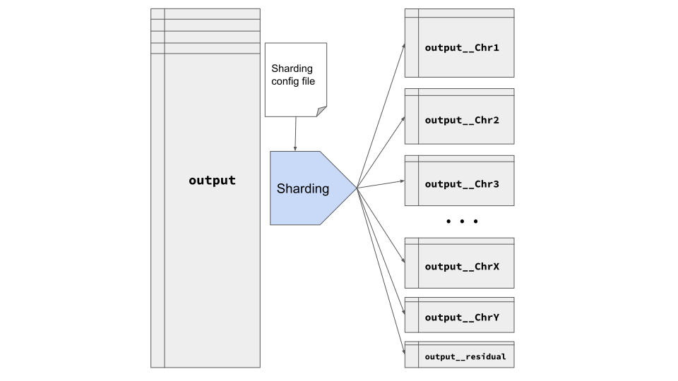

# Sharding output table

Variant Transforms splits the output table into several smaller tables
each containing variants of a specific region of a genome. We call this
procedure sharding. Sharding the output table significantly reduces query
costs and also optimizes the cost and time of running Variant Transforms'
pipeline. In fact, without sharding, importing large inputs such as
1000Genomes to BigQuery would be very costly and time consuming,
especially if [variant merging](variant_merging.md) options are set.

Variant Transforms uses a config file to perform sharding. Our
[default sharding config file](https://github.com/googlegenomics/gcp-variant-transforms/blob/master/gcp_variant_transforms/data/sharding_configs/homo_sapiens_default.yaml)
splits variants into 25 tables, one for each chromosome. Following figure 
schematically shows how Variant Transforms performs sharding:



Splitting output tables based on the `reference_name` guarantees that
per-chromosome queries will only process variants of the chromosome under study. 
Also, sharding is required if we want to utilize BigQuery 
[partitioining](query_cost.md).

You can define your shards to be more finely grained than the default config
we have provided (which is at the chromosome level). For example based on your
use case you might have multiple tables per chromosome. Also, as the name suggests,
[homo_sapiens_default](https://github.com/googlegenomics/gcp-variant-transforms/blob/master/gcp_variant_transforms/data/sharding_configs/homo_sapiens_default.yaml)
is designed for the human genome. If you need a sharding config for organisms
other than human, you can modify the default config file. In the next section,
we explain the details of our config file.

If you need help modifying the default config file for your use case,
then please reach out to us by submitting a Github issue so we can help.

## Sharding Config file

The config file is set using the `--sharding_config_path` flag and is
formatted as a [YAML](https://en.wikipedia.org/wiki/YAML) file with a
straightforward structure. [Here](https://github.com/googlegenomics/gcp-variant-transforms/blob/master/gcp_variant_transforms/data/sharding_configs/homo_sapiens_default.yaml)
you can find the default config file that splits the output table into 25 tables,
one per chromosome plus an extra [residual shard](#residual-shard).
We use this config file as the default for all runs of Variant Transforms.
In other words, `--sharding_config_path` default value points to this default
config file. Here is a snippet of that file:

```
-  output_table:
     table_name_suffix: "chr1"
     regions:
       - "chr1"
       - "1"
     partition_range_end: 249,240,615
```

This config file defines a shard that will include all variants whose
`reference_name` is equal to one of the given values for regions field,
namely `chr1` or `1`. Note that the `reference_name` string is *case-sensitive*,
so if your variants have `Chr1` or `CHR1` they will **not** be matched to this shard.

The final output table name for this shard will have `__chr1` suffix. More precisely,
if you use the following flag to set the name of your output table:

```
--output_table my-project:my_dataset.my_table
```

then the output table corresponding to this shard (which contains chromosome 1
variants) will be stored at:

```
my-project:my_dataset.my_table__chr1
```

You can use any string as a suffix for your table names. Here, for simplicity,
we used the same string (`chr1`) for both `reference_name` matching
(under `region` field) and table suffix.

### Partition Range End

Other than `table_name_suffix` and `regions`, each `output_table` entry
in the sharding config file has another field: `partition_range_end`.
The value of this field is used for conducting [integer range partitioning](query_cost.md)
on the output table. We use this number and then split it into 3999 partitions,
which is the maximum allowed number of partitions minus 1. For example,
in the previous example, partition_range_end is set to `249,240,615`.
Based on this number we choose the 
[width of partition intervals](https://cloud.google.com/bigquery/docs/creating-integer-range-partitions#creating_an_empty_partitioned_table_with_a_schema_definition)
to be `62340`. This means:

 * All variants with `start_position` in `[0, 62340)` range will be in the first partition.
 * All variants with `start_position` in `[62340, 2*62340)` will be in the second partition.
 * ...
 * All variants with `start_position` in `[3998*62340, 3999*62340)` will be in the 3999th partition.
 
As one can see, the *partition range end* value ends up `3999 * 62340 = 249,297,660`
which is larger than the original value given in the sharding config `249,240,615`.
We deliberately made the range end a bit larger to make sure we accommodate cases
where the user does not exactly know the size of a chromosome. Please refer to
`calculate_optimal_range_interval` method in
[`partitioning.py`](https://github.com/googlegenomics/gcp-variant-transforms/blob/master/gcp_variant_transforms/libs/partitioning.py)
module for more details. We only use 3999 partitions because we reserve the
last one as the *default partition*. The default partition contains any variants
that do not belong to any of the other 3999 aforementioned partitions.

#### Adaptive versus fixed partitions

Examining our [default sharding config file](https://github.com/googlegenomics/gcp-variant-transforms/blob/master/gcp_variant_transforms/data/sharding_configs/homo_sapiens_default.yaml)
shows that we use different `partition_range_end` values for each chromosome.
Following table summarizes these values for a couple of chromosomes:

| Chromosome | Partition Range End |
|------------|---------------------|
| `chr1`     | 249,240,615         |
| `chr2`     | 243,189,284         |
| `chr3`     | 198,233,091         |
| `chr21`    | 48,119,890          |
| `chr22`    | 51,244,528          |
| `chrX`     | 156,030,808         |
| `chrY`     | 57,227,415          |

These values correspond to the size of each chromosome. We found these values by
examining the gnomAD dataset and finding the largest `start_position` value for
each chromosome using [gnomAD on GCP Marketplace](https://console.cloud.google.com/marketplace/details/broad-institute/gnomad)
BigQuery tables. Using these `partition_range_end` values enables us to perfectly
fit 3999 partitions to each table and fully take advantage of cost-saving benefits
of BigQuery partitioning. We call this *adaptive partitioning*, because each
chromosome has a different partitioning interval.

Output tables with adaptive partitioning have one downside: BigQuery does not
allow to [create a view](https://cloud.google.com/bigquery/docs/views)
over tables with different partitioning intervals. Similarly, BigQuery does not
allow querying [multiple tables using wildcard](https://cloud.google.com/bigquery/docs/querying-wildcard-tables)
if selected tables have different partitioning intervals. Both of these two cases
fail with this error message:

```
 "errors": [
      {
        "message": "Wildcard matched incompatible partitioning tables,
                   first table PROJECT_ID:DATASET_ID.variants__chr1,
                   first incompatible table PROJECT_ID:DATASET_ID.variants__chr10.",
        "domain": "global",
        "reason": "invalid"
      }
    ],
```

Because these two features might be critical to the workflow of some of our users,
we offer [another partitioning config file](https://github.com/googlegenomics/gcp-variant-transforms/blob/master/gcp_variant_transforms/data/sharding_configs/homo_sapiens_fixed_partitions.yaml)
that utilizes fixed partitioning. This means we use the same `partition_range_end`
value for all chromosomes, namely the largest chromosome: `chr1`. We know this
slightly degrades the query cost reduction potential of BigQuery partitioning,
especially for smaller chromosomes such as `chr21` or `chr22`, but doing so allows
our users to create views and run queries over multiple tables. In order to run
Variant Transforms with fixed partitioning, please add the following flag to your
`vcf_to_bq` command:

```
--sharding_config_path gcp_variant_transforms/data/sharding_configs/homo_sapiens_fixed_partitions.yaml
``` 

### Multiple shards per chromosome

As we mentioned earlier, sharding can be done at a more fine grained level and
does not have to be limited to chromosomes. For example, the following config
defines two shards that contain variants of chromosome X:

```
-  output_table:
     table_name_suffix: "chrX_first_100M"
     regions:
       - "chrX:0-100,000,000"
     partition_range_end: 100,000,000
-  output_table:
     table_name_suffix: "chrX_remaining"
     regions:
       - "chrX:100,000,000-999,999,999"
     partition_range_end: 156,030,808
```
If the *start position* of a variant on chromosome X is less than `100,000,000`
then it will be assigned to `chrX_first_100M` table, otherwise it will be
assigned to `chrX_remaining` table.

### Residual Shard

All shards defined in a config file follow the same principle: variants will
be assigned to them based on their defined regions. The only exception is the
`residual` shard, which acts as the *default shard*: all variants not assigned
to any shard will end up in this shard. For example, consider the following
config file:

```
-  output_table:
     table_name_suffix: "first_50M"
     regions:
       - "chr1:0-50,000,000"
       - "chr2:0-50,000,000"
       - "chr3:0-50,000,000"
     partition_range_end: 50,000,000
-  output_table:
     table_name_suffix: "second_50M"
     regions:
       - "chr1:50,000,000-100,000,000"
       - "chr2:50,000,000-100,000,000"
       - "chr3:50,000,000-100,000,000"
     partition_range_end: 100,000,000
-  output_table:
     table_name_suffix: "all_remaining"
     regions:
       - "residual"
```

This config file splits all the variants into 3 tables:
 * `first_50M`: all variants of `chr1`, `chr2`, and `chr3` whose `start_position`
 is `< 50M`
 * `second_50M`: all variants of `chr1`, `chr2`, and `chr3` whose `start_position`
 is `>= 50M` and `< 100M`
 * `all_remaining`: all remaining variants. This includes:
   * All variants of `chr1`, `chr2`, and `chr3` with start position `>= 100M`
   * All variants of other chromosomes.

Using the `residual` shard, you can make sure your output tables will include
*all* input variants. However, if you don't need the residual variants, then
you can simply remove the last shard from your config file. If you removed
the last shard from the previous example, then you would have only 2 tables
as output, and variants that do not match either of those two shards would
be dropped from the final output.

This feature can be used more broadly for filtering out unwanted variants from
the output tables. Filtering reduces the cost of running Variant Transforms.
