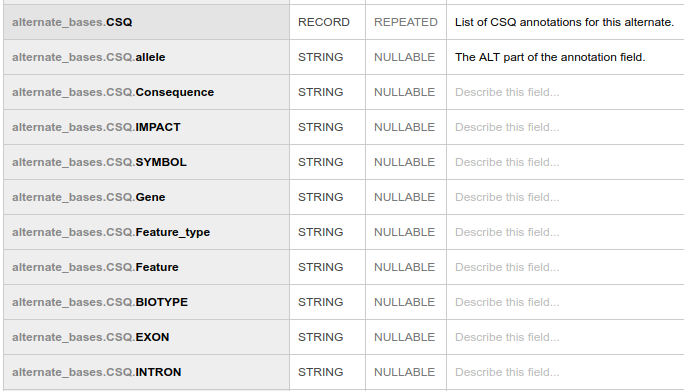
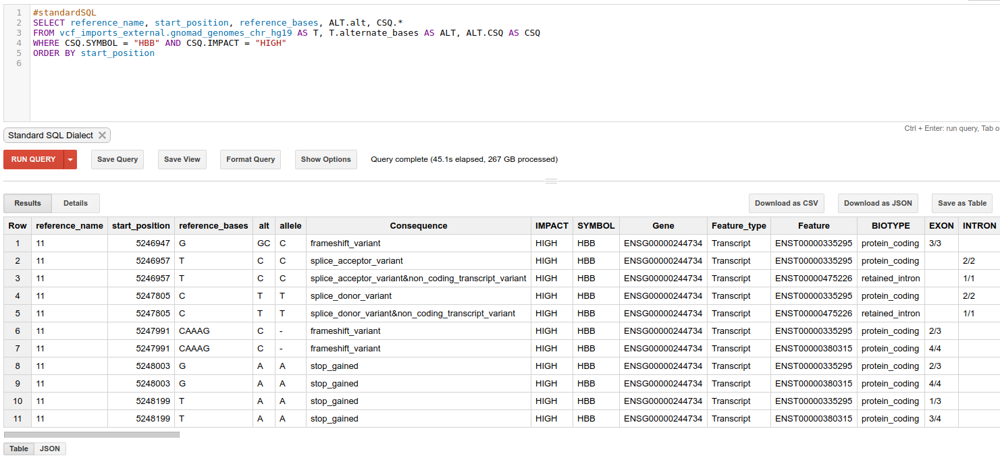
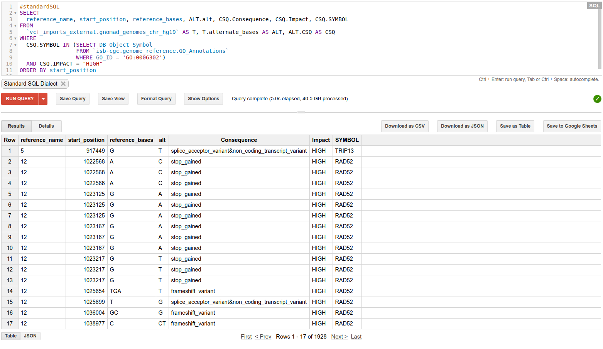

# Annotation Support in Variant Transforms

## Overview

Tha annotation support in Variant Transforms has two goals:
* First, we want to be able to properly parse annotation fields in input VCFs.
* The second goal is to be able to annotate VCF files during the import process,
using open annotation tools/databases like
[Variant Effect Predictor](http://ensembl.org/info/docs/tools/vep/index.html)
(VEP).

## Parsing Annotation Fields

The annotation field format that is currently supported is based on
[this spec](http://snpeff.sourceforge.net/VCFannotationformat_v1.0.pdf)
developed in the SnpEff project. VEP uses the same format and here is a trimmed
example from a file annotated by VEP (taken from the
[gnomAD](http://gnomad.broadinstitute.org/) dataset):

VCF Header:
```
##INFO=<ID=CSQ,Number=.,Type=String,Description="Consequence annotations from Ensembl VEP. Format: Allele|Consequence|IMPACT|SYMBOL|Gene|Feature_type|Feature|BIOTYPE|EXON|INTRON|ALLELE_NUM|...>
```
Corresponding annotations for a sample variant record where `REF=AAC` and
`ALT=TAC,A`:
```
CSQ=-|downstream_gene_variant|MODIFIER|WASH7P|ENSG00000227232|Transcript|ENST00000423562|unprocessed_pseudogene|||2,...,T|upstream_gene_variant|MODIFIER|DDX11L1|ENSG00000223972|Transcript|ENST00000518655|transcribed_unprocessed_pseudogene|||1
```
For each variant record, multiple annotation lists are provided which are
separated by comma. The first field of each set refers to an alternate allele or
`ALT` (for details of the format see
[the spec](http://snpeff.sourceforge.net/VCFannotationformat_v1.0.pdf)).
Note that the actual record of the above example, has more fields and also each
alternate allele can be repeated multiple times (with different annotations);
here we have only selected a small sub-set, one for each `ALT`.

When [`--annotation_fields`](https://github.com/googlegenomics/gcp-variant-transforms/blob/c4659bba2cf577d64f15db5cd9f477d9ea2b51b0/gcp_variant_transforms/options/variant_transform_options.py#L156)
flag is used, annotation lists are split and moved under
their corresponding `alternate_bases` records. In other words, there will be a
repeated record field `CSQ` under each `alternate_bases`:



### Alternate Allele Matching

As it can be seen in the above example, the alternate alleles listed in the
`CSQ` field are different from `ALT` strings of the variant record (for example
the `AAC->C` variant is represented by a single `-` which means a deletion).
This is because, the gnomAD dataset is run through VEP with the
[`--minimal`](http://useast.ensembl.org/info/docs/tools/vep/script/vep_options.html#opt_minimal)
option. Variant Transforms supports matching alt fields in the minimal mode. There are actually
three supported modes of `ALT` matching:

* If no `ALT` matching flag is set,
[the spec](http://snpeff.sourceforge.net/VCFannotationformat_v1.0.pdf) is
implemented by default (support for cancer samples is not currently implemented
and is tracked by
[this issue](https://github.com/googlegenomics/gcp-variant-transforms/issues/200)).

* With [--use_allele_num](https://github.com/googlegenomics/gcp-variant-transforms/blob/c4659bba2cf577d64f15db5cd9f477d9ea2b51b0/gcp_variant_transforms/options/variant_transform_options.py#L164),
the value of the `ALLELE_NUM` annotation field is looked up, which is
[a feature of VEP](http://useast.ensembl.org/info/docs/tools/vep/script/vep_options.html#opt_allele_number).
This is the case in the above example.

* Variant Transforms can also simulate the `--minimal` mode of VEP with
[--minimal_vep_alt_matching](https://github.com/googlegenomics/gcp-variant-transforms/blob/c4659bba2cf577d64f15db5cd9f477d9ea2b51b0/gcp_variant_transforms/options/variant_transform_options.py#L173)
but this is not recommended as it can result in ambiguous matching.
The number of such ambiguous cases are counted and reported in the Dataflow
dashboard. Also with this flag, a new field is added to the output BigQuery
table to mark ambiguous cases. This should be used only as a last resort.

## Running VEP through Variant Transforms

While parsing annotation fields and breaking them into separate fields is a
useful feature but it still requires pre-annotated VCFs. To address this need,
we have started an effort to provide options to annotate input files as part of
the BigQuery import process, i.e., automatically done by Variant Transforms.

Currently, this option is only supported for VEP and that is done by bringing up
Virtual Machines (VM) on Google Cloud Platform (GCP) and running VEP docker
images. This is slow and improving this experience is on our roadmap.

Relevant flags for this feature are:
* [`--run_annotation_pipeline`](https://github.com/googlegenomics/gcp-variant-transforms/blob/c4659bba2cf577d64f15db5cd9f477d9ea2b51b0/gcp_variant_transforms/options/variant_transform_options.py#L184)
enables the automatic annotation feature.

* [`--annotation_output_dir`](https://github.com/googlegenomics/gcp-variant-transforms/blob/c4659bba2cf577d64f15db5cd9f477d9ea2b51b0/gcp_variant_transforms/options/variant_transform_options.py#L190)
a path on Google Cloud Storage (GCS) where VEP output files are copied. The file
hierarchy of input files is replicated at this location with the same file names
followed by `_vep_output.vcf`.

* [`--vep_image_uri`](https://github.com/googlegenomics/gcp-variant-transforms/blob/c4659bba2cf577d64f15db5cd9f477d9ea2b51b0/gcp_variant_transforms/options/variant_transform_options.py#L196)
the docker image for VEP created using the
[Dockerfile in variant-annotation](https://github.com/googlegenomics/variant-annotation/tree/master/batch/vep)
GitHub repo.
<!-- TODO(bashir2): Add the location of the image we maintain. -->

* [`--vep_cache_path`](https://github.com/googlegenomics/gcp-variant-transforms/blob/c4659bba2cf577d64f15db5cd9f477d9ea2b51b0/gcp_variant_transforms/options/variant_transform_options.py#L200)
the GCS location that has the compressed version of VEP cache. This file can be
created using
[build_vep_cache.sh](https://github.com/googlegenomics/variant-annotation/blob/master/batch/vep/build_vep_cache.sh)
script.
<!-- TODO(bashir2): Add the location of the cache we maintain. -->

* [`--vep_info_field`](https://github.com/googlegenomics/gcp-variant-transforms/blob/c4659bba2cf577d64f15db5cd9f477d9ea2b51b0/gcp_variant_transforms/options/variant_transform_options.py#L204)
by default, an INFO field called `CSQ_VT` is added to hold the new
annotations; use this field to override the field name.

* [`--vep_num_fork`](https://github.com/googlegenomics/gcp-variant-transforms/blob/c4659bba2cf577d64f15db5cd9f477d9ea2b51b0/gcp_variant_transforms/options/variant_transform_options.py#L208)
number of forks when running VEP, see [`--fork` option of VEP](ensembl.org/info/docs/tools/vep/script/vep_options.html#opt_fork).

For other parameters, like how many VMs to use or where the VMs should be
located, the same parameters for
[Dataflow pipeline execution](https://cloud.google.com/dataflow/pipelines/specifying-exec-params)
are reused, e.g., `--num_workers`.

## Sample Queries

### Querying annotations directly

We imported the gnomAD genomes table using the features described in
[Parsing Annotation Fields](#parsing-annotation-fields). Here is a sample
query to extract high impact variants in the HBB gene which encodes the beta
chain of Haemoglobin:
```
#standardSQL
SELECT
  reference_name, start_position, reference_bases, ALT.alt, CSQ.*
FROM
  vcf_imports_external.gnomad_genomes_chr_hg19 AS T, T.alternate_bases AS ALT, ALT.CSQ AS CSQ
WHERE
  CSQ.SYMBOL = "HBB" AND CSQ.IMPACT = "HIGH"
ORDER BY start_position
```

and here is a snapshot from the BigQuery UI for this query:



Note that the gnomAD dataset does not have any calls or samples but it is fairly
simple practice to extend this query to pick samples that have these high impact
variants.

<!-- TODO(bashir): Add some interpretation of these variants, e.g., with
reference to sickle-cell and thalassemia. This needs to be done using other
fields to extract phenotype information from other databases. -->

### Joining with other databases

You can also join with other databases that are available in BigQuery.
For instance, there are several pathway databases that are available publicly in
BigQuery. Here is a sample query to extract high impact variants that are in
the double-strand break repair pathway as defined by the
[GO (Gene Ontology) biological process (GO:0006302)](http://amigo.geneontology.org/amigo/term/GO:0006302).

```
#standardSQL
SELECT
  reference_name, start_position, reference_bases, ALT.alt, CSQ.*
FROM
  vcf_imports_external.gnomad_genomes_chr_hg19 AS T, T.alternate_bases AS ALT, ALT.CSQ AS CSQ
WHERE
  CSQ.SYMBOL IN (SELECT DB_Object_Symbol
                 FROM `isb-cgc.genome_reference.GO_Annotations`
                 WHERE GO_ID = 'GO:0006302')
  AND CSQ.IMPACT = "HIGH"
ORDER BY start_position
```



Other pathway databases are also available in BigQuery including
[Reactome](https://reactome.org/)
([table](https://bigquery.cloud.google.com/table/isb-cgc:genome_reference.Ensembl2Reactome?tab=details))
and [WikiPathways](https://www.wikipathways.org)
([table](https://bigquery.cloud.google.com/table/isb-cgc:QotM.WikiPathways_20170425_Annotated?tab=details)).

