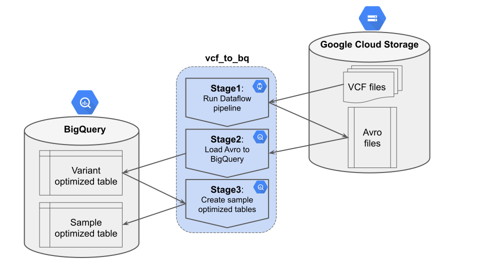
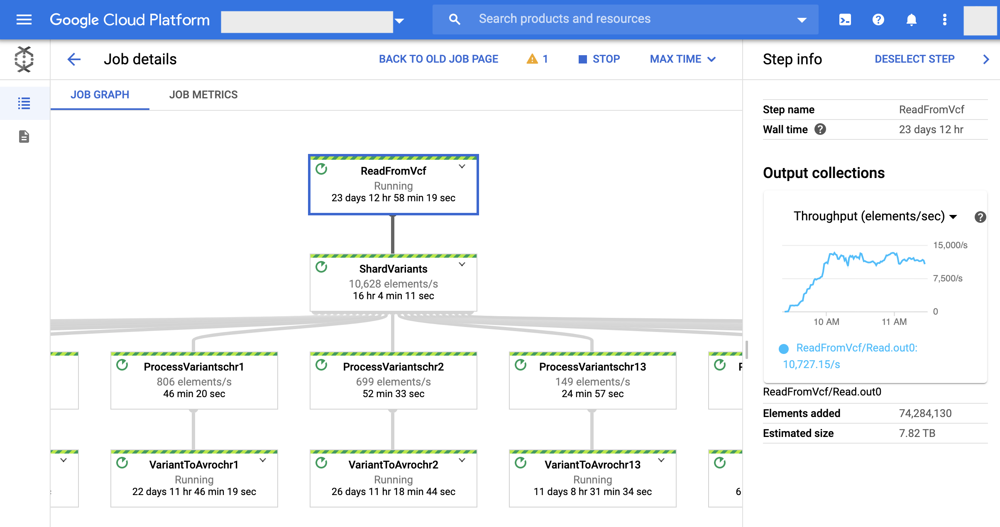
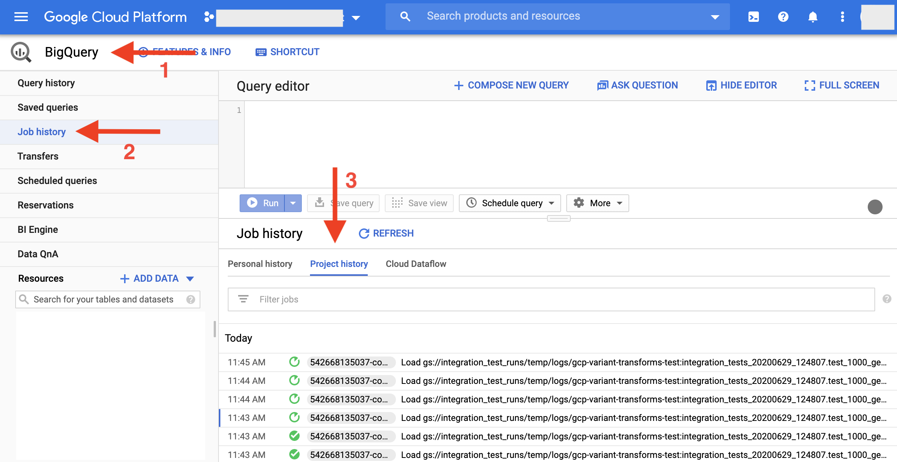
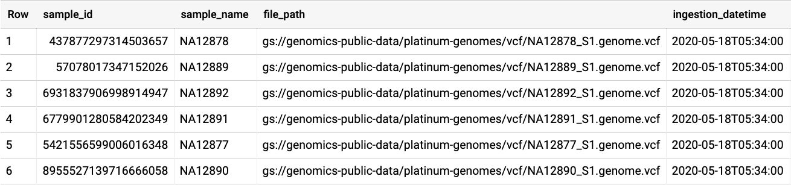

# VCF to BigQuery

The VCF to BigQuery pipeline performs the main application of Variant Transforms:
parsing input VCF files and loading them into BigQuery tables. We perform this task
through 3 intermediate stages:



## Stage 1: Run Dataflow pipeline

In this stage, Variant Transforms reads VCF files from the input
[Google Cloud Storage](https://cloud.google.com/storage/docs/how-to)
bucket, [shards](sharding.md) the variants, and writes the output [Avro](http://avro.apache.org/)
files back to Google Cloud Storage. The following image shows an example of 
this Dataflow job:



This stage converts raw text-formatted VCF files into Avro, a compact, fast, binary data format.
During this process, Variant Transforms checks for inconsistencies in VCF headers and records to
ensure all records in the output Avro files are correct.

The Avro format is a strong alternative to storing raw VCF files for archival purposes.
Our empirical results show that Avro files are more compressed compared to VCF files. 
For example, [Illumina Platinum Genomes](https://www.illumina.com/platinumgenomes.html)
are `30.66 GiB` in VCF format (located at
[`gs://genomics-public-data/platinum-genomes`](https://console.cloud.google.com/storage/genomics-public-data/platinum-genomes/))
while in Avro format they are `5.34 GiB`. This compression does not apply to all VCF files,
particularly joint genotyped VCF files, bacause multiple repeated samples are more
compressed in VCF format. For example, [phase 3 1000Genomes](https://www.internationalgenome.org/data/) 
(located at
['gs://genomics-public-data/1000-genomes-phase-3/vcf-20150220/'](https://console.cloud.google.com/storage/genomics-public-data/1000-genomes-phase-3/vcf-20150220/))
is `795 GiB` in VCF format while Avro files are `1.9 TiB`.

In addition, as we see in the next section, Avro files can be loaded directly into
BigQuery, free of charge. These properties make Avro files a viable option for
long-term storage of variant data.

## Stage 2: Load Avro to BigQuery

After the Dataflow pipeline finishes successfully, Variant Transforms loads the
[Avro files into BigQuery](https://cloud.google.com/bigquery/docs/loading-data-cloud-storage-avro).
Avro files have
[many advantages](https://cloud.google.com/bigquery/docs/loading-data-cloud-storage-avro#advantages_of_avro)
for this purpose, but for our use case, the main advantage is fast and
[free import](https://cloud.google.com/bigquery/pricing#free)
of Avro files into BigQuery. You can follow the progress of this stage from your
Google Cloud console page:



BigQuery tables generated at this stage are optimized to answer *variant lookup*
queries such as:

```
Find all variants in a genomic region
``` 

That's because we [partition](sharding.md) these tables based on the `start_position` column.
For this reason, we call this set of tables *variant-optimized* tables.

Some users, as a part of their workflow, need to run *sample lookup* queries such as:

```
Find all variant of sample X
```

Executing this type of query on variant-optimized tables is costly, 
because all rows need to be processed. The cost of such queries can be significant,
especially if sample lookup queries are executed frequently. For cases like this,
we offer another set of tables called *sample-optimized* tables. As their name suggests,
they are optimized for answering queries of the latter type. Sample-optimized tables are
generated in stage 3 of VCF to BigQuery. These tables are not generated by default;
users need to set a special flag to activate this functionality.

## Stage 3: Create Sample Optimized Tables

Users can store a sample-optimized table by setting their base name using the following flag:

```
--sample_lookup_optimized_output_table GOOGLE_CLOUD_PROJECT:BIGQUERY_DATASET.SAMPLE_OPT_TABLE
```

Setting this flag will cause a second set of tables to be generated. Similar to variant-optimized
tables, these tables will be [sharded](sharding.md) and have the same suffixes (extracted from 
sharding config file).


Storing sample-optimized tables will increase
your BigQuery [storage costs](https://cloud.google.com/bigquery/pricing#pricing_summary),
but the extra cost will be quickly recovered through *significant* saving of reduced cost of sample
lookup queries.

Sample-optimized tables have a schema which is very similar to the original variant-optimized
tables. There are only two differences:

* Repeated call column is flattened, so that each call ends up in a separate row.
* A new `sample_id` column, which has the same value as `call.sample_id column`, is added.

Let's consider a concrete example: variant-optimized tables of [phase 3 1000Genomes](https://www.internationalgenome.org/data/)
dataset have `6,468,094` rows in its `__chr1` shard. We know phase 3
includes `2504` individuals, so each row of this table has `2504` repeated `call` fields.
If we execute a sample lookup query on this table, it will process the whole table,
which is `408.13 GB`. According to the current [BigQuery pricing model](https://cloud.google.com/bigquery/pricing#queries),
the query will cost about `$2`.

The corresponding sample-optimized table for `__chr1` shard has `6,468,094 x 2504 = 16,196,107,376`
rows and is about `2.6 TB` in size. [Long-term storage cost](https://cloud.google.com/bigquery/pricing#pricing_summary)
of this table is about `$27` per month. However, running a sample lookup query on this
table processes `1052 MB` costing `$0.005`. Therefore, if you run at least 14 sample
lookup queries a month, then your overall cost will be lower if you store sample-optimized tables.

# Sample Info table

Variant Transforms replaces `call.name` with `call.sample_id`, where `sample_id` is
the [hash value](https://github.com/google/farmhash/commits/master) of the call name.
We had to make this change for one main reason: to be able to apply BigQuery
[integer range partitioning](https://cloud.google.com/bigquery/docs/creating-integer-range-partitions)
to this column and therefore be able to perform sample lookup queries efficiently.
For more information about partitioning, please refer to [our sharding docs](sharding.md).

In order to allow users to retrieve the original `name`s, we store a table that
contains the mapping between our id and original names. This table is stored with the 
same base table name as variant-optimized tables and with `__sample_info` suffix. 
The following image shows an example of this table:



In addition to the mapping of integer ID to the string names, this table includes
`vcf_file_path` and `ingestion_datetime` columns to record for each sample the ingestion
datetime and the location of source VCF file in Google Storage bucket. BigQuery allows you
to easily join this table to the main variant tables (using a [view](https://cloud.google.com/bigquery/docs/views)),
so replacing `name` with `sample_id` should be transparent from the user's perspective.
If you need help with this, please reach out to us.

In cases where multiple VCF files use the same `sample_names` for different underlying
samples/individuals and you'd like to import them into BigQuery under different IDs, you can
include the file path in the hashing value to distinguish between samples. In that case, `sample_id`
will be the hash value of `[sample_name, file_path]`. You can activate this feature by
setting `--sample_name_encoding WITH_FILE_PATH`.
  
